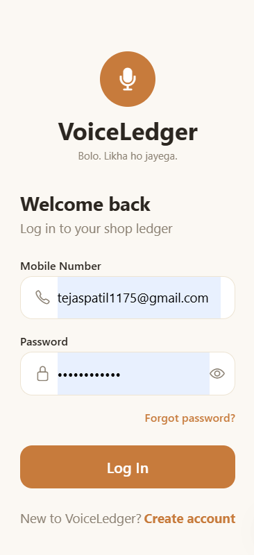
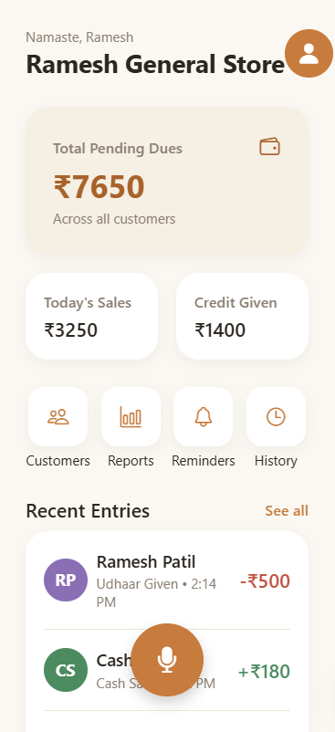
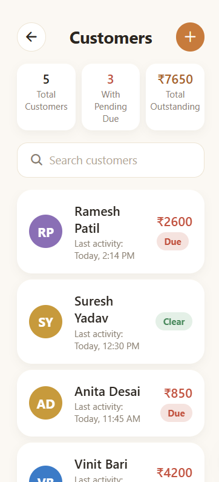
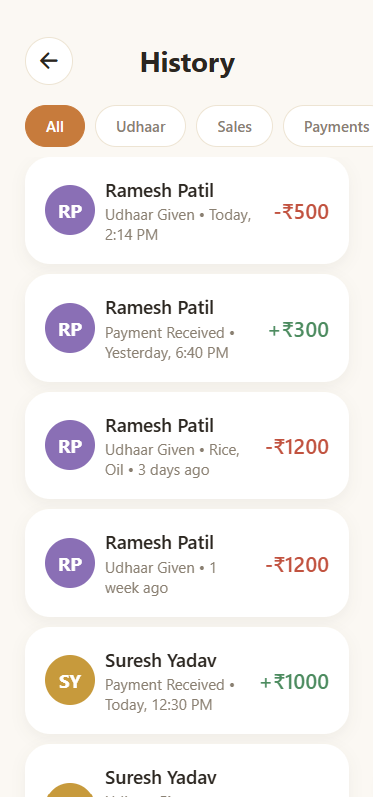
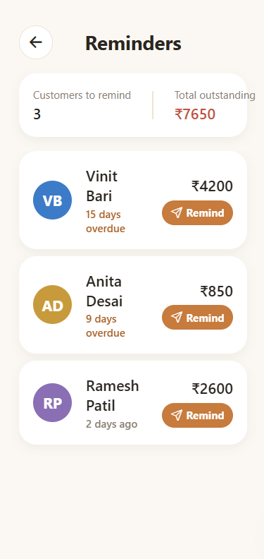
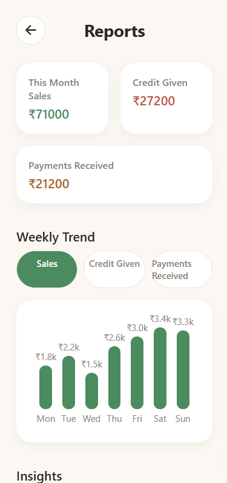

# VoiceLedger

Offline, voice-first ledger app for India's small shopkeepers and street vendors. Speak a transaction naturally in Hindi, Marathi, or Hinglish, and the phone transcribes, understands, and records it as a structured ledger entry — fully on-device, with no internet connection and no cloud service involved.

  
  
  
  
  
  
  
  
  

---

## The Core Idea

VoiceLedger is an offline, voice-first ledger app for India's small shopkeepers and street vendors. Instead of typing entries into a bookkeeping app, the shopkeeper simply speaks a transaction naturally — in Hindi, Marathi, or Hinglish — and the phone transcribes, understands, and records it as a structured ledger entry. Everything happens on-device, with no internet connection and no cloud service involved.

## Who It's For

India has 60M+ kirana stores, roadside vendors, and micro-businesses. Most still track sales and customer credit (udhaar) in a paper notebook because:

- They're busy serving customers — no time to stop and type
- Many operate in low or no-connectivity areas
- They think and speak in local languages, not English app UI
- Existing digital ledger apps (like Khatabook) still require typing and stable internet

VoiceLedger removes all three barriers at once.

## App Preview

<table>
  <tr>
    <td align="center"></td>
    <td align="center"></td>
    <td align="center"></td>
  </tr>
  <tr>
    <td align="center"></td>
    <td align="center"></td>
    <td align="center"></td>
  </tr>
</table>

## How It Works (User Flow)

1. **Speak** — "Ramesh ko 500 rupaye udhaar diya" (gave Ramesh ₹500 on credit)
2. **Transcribe** — Whisper Tiny converts speech to text, fully offline
3. **Structure** — A local LLM (Phi-3 or Gemma 2B) extracts the customer name, amount, item, and whether it's credit or debit
4. **Record** — Entry is saved instantly; running totals and pending dues update in the ledger view

## Technical Architecture

| Component | Role |
|---|---|
| Mic input | Captures the spoken transaction |
| Whisper Tiny (on-device STT) | Converts speech to raw text |
| Local LLM — Phi-3 / Gemma 2B (on-device) | Parses raw text into structured data (name, amount, type) |
| Structured entry (JSON) | Clean record built locally |
| On-device ledger store | Stores entries, computes running totals and pending dues |

All AI inference runs on the Snapdragon NPU — this is the part that genuinely justifies "phone-first," since it can't be meaningfully replicated on a laptop-only build.

### Architecture Docs

| Diagram | Description |
|---|---|
| [System Architecture](architecture/system-architecture.md) | Full flow from mic input to ledger update |
| [Data Flow](architecture/data-flow.md) | Sequence of a single voice entry through the pipeline |
| [Component Diagram](architecture/component-diagram.md) | App and on-device AI layer breakdown |

### Engineering Docs

| Doc | Description |
|---|---|
| [Technical Design Document](docs/technical-design-document.md) | Purpose, goals, architecture, tech stack, risks, milestones |
| [Data Model](docs/data-model.md) | Customer and LedgerEntry schemas, structured LLM output contract |
| [API Contracts](docs/api-contracts.md) | Internal interfaces between STT, parsing, and data layer |
| [Non-Functional Requirements](docs/non-functional-requirements.md) | Latency, accuracy, offline, and privacy targets |
| [Testing Strategy](docs/testing-strategy.md) | Test plan across STT, parsing, ledger, and end-to-end |
