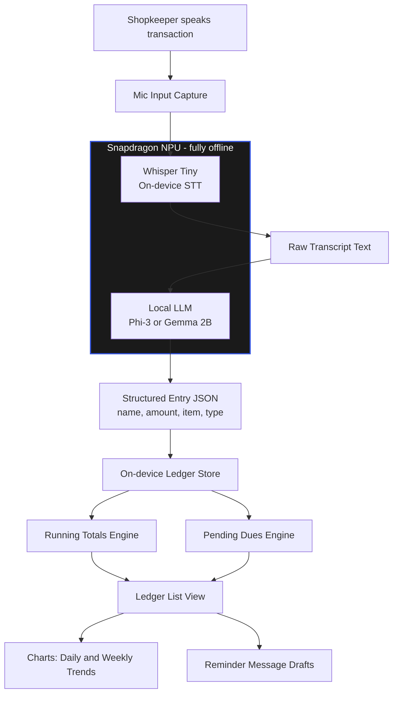

# VoiceLedger

Offline, voice-first ledger app for India's small shopkeepers and street vendors. Speak a transaction naturally in Hindi, Marathi, or Hinglish, and the phone transcribes, understands, and records it as a structured ledger entry — fully on-device, with no internet connection and no cloud service involved.

  
  
  
  
  
  
  
  
  

---

## The Core Idea

VoiceLedger is an offline, voice-first ledger app for India's small shopkeepers and street vendors. Instead of typing entries into a bookkeeping app, the shopkeeper simply speaks a transaction naturally — in Hindi, Marathi, or Hinglish — and the phone transcribes, understands, and records it as a structured ledger entry. Everything happens on-device, with no internet connection and no cloud service involved.

## Who It's For

India has 60M+ kirana stores, roadside vendors, and micro-businesses. Most still track sales and customer credit (udhaar) in a paper notebook because:

- They're busy serving customers — no time to stop and type
- Many operate in low or no-connectivity areas
- They think and speak in local languages, not English app UI
- Existing digital ledger apps (like Khatabook) still require typing and stable internet

VoiceLedger removes all three barriers at once.

## How It Works (User Flow)

1. **Speak** — "Ramesh ko 500 rupaye udhaar diya" (gave Ramesh ₹500 on credit)
2. **Transcribe** — Whisper Tiny converts speech to text, fully offline
3. **Structure** — A local LLM (Phi-3 or Gemma 2B) extracts the customer name, amount, item, and whether it's credit or debit
4. **Record** — Entry is saved instantly; running totals and pending dues update in the ledger view

## Technical Architecture

| Component | Role |
|---|---|
| Mic input | Captures the spoken transaction |
| Whisper Tiny (on-device STT) | Converts speech to raw text |
| Local LLM — Phi-3 / Gemma 2B (on-device) | Parses raw text into structured data (name, amount, type) |
| Structured entry (JSON) | Clean record built locally |
| On-device ledger store | Stores entries, computes running totals and pending dues |

All AI inference runs on the Snapdragon NPU — this is the part that genuinely justifies "phone-first," since it can't be meaningfully replicated on a laptop-only build.

### Architecture Diagram

## Build Plan

Matches the hackathon's Red Light / Green Light structure.

### Red Light — Phone only

- Mic capture + Whisper Tiny transcription
- Local LLM parsing of the transcript into structured fields
- Core ledger list view with running totals

### Green Light — Phone + laptop via Office Kit

- UI polish and visual design
- Charts for daily/weekly spend and credit trends
- Draft reminder messages for pending dues
- Record the demo video walkthrough

## Why It Fits This Hackathon Specifically

- **Phone-first execution** — the mic and NPU aren't add-ons, they are the product
- **Real AI integration** — two genuine on-device models doing real work, not a cloud API wrapper
- **Office Kit usage** — a natural fit in the Green Light phase, not forced in
- **Real-world relevance** — every judge instantly understands the problem, no domain explanation needed
- **Feasible in 30 hours** — one tight, working core loop rather than an overambitious, half-finished build

## The Differentiator vs. Existing Apps

Apps like Khatabook digitize the ledger but still require typing. VoiceLedger's edge is that it removes the interaction barrier entirely — speech in, structured record out, zero typing, zero internet dependency.

## Status

| Item | Status |
|---|---|
| Idea, architecture, and pitch deck | Ready |
| Prototype / demo video | In progress — optional for Phase 1, strengthens shortlisting |
| Team strengths section | Pending — needs each teammate's actual skills filled in |

## Team

**Neural Ninjas**

| Name | Role / Skills |
|---|---|
| Tejas Bachhav | MERN Stack (MongoDB, Express, React, Node.js), React Native, on-device AI integration |
| Vinit Bari | TBD |
| Yash Chavan | TBD |
| Pranav Patil | TBD |
