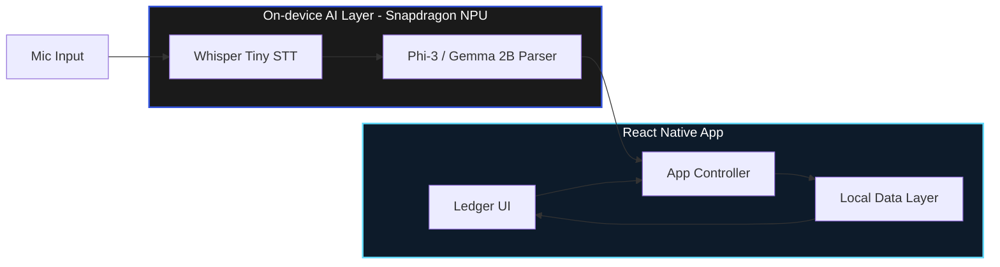

# Component Diagram

App-level component breakdown across the mobile app and on-device AI layer.

```mermaid
graph LR
    subgraph MobileApp[React Native App]
        UI[Ledger UI]
        Ctrl[App Controller]
        Store[Local Data Layer]
    end

    subgraph AILayer[On-device AI Layer - Snapdragon NPU]
        STT[Whisper Tiny STT]
        NLU[Phi-3 / Gemma 2B Parser]
    end

    Mic[Mic Input] --> STT
    STT --> NLU
    NLU --> Ctrl
    Ctrl --> Store
    Store --> UI
    UI --> Ctrl

    style AILayer fill:#1a1a1a,stroke:#3253DC,stroke-width:2px,color:#ffffff
    style MobileApp fill:#0d1b2a,stroke:#61DAFB,stroke-width:2px,color:#ffffff
```

[Back to README](../README.md)
