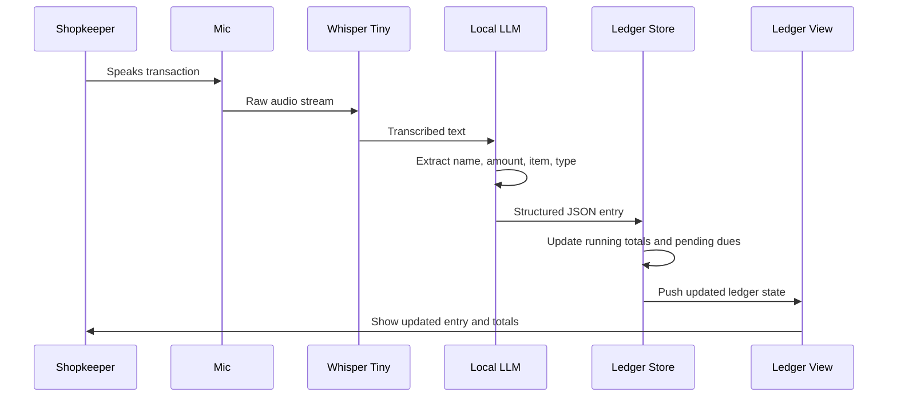

# Data Flow

How a single voice entry moves through the pipeline and updates state.

```mermaid
sequenceDiagram
    participant U as Shopkeeper
    participant M as Mic
    participant W as Whisper Tiny
    participant L as Local LLM
    participant S as Ledger Store
    participant UI as Ledger View

    U->>M: Speaks transaction
    M->>W: Raw audio stream
    W->>L: Transcribed text
    L->>L: Extract name, amount, item, type
    L->>S: Structured JSON entry
    S->>S: Update running totals and pending dues
    S->>UI: Push updated ledger state
    UI->>U: Show updated entry and totals
```

[Back to README](../README.md)
