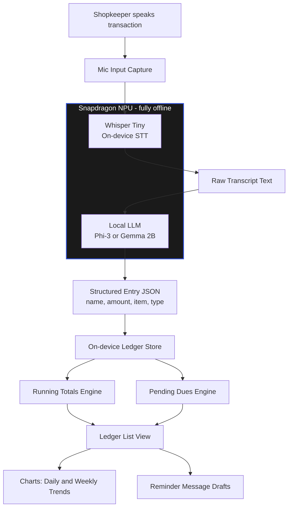

# System Architecture

End-to-end flow from spoken transaction to ledger update, fully on-device.

```mermaid
flowchart TD
    A[Shopkeeper speaks transaction] --> B[Mic Input Capture]
    B --> C[Whisper Tiny\nOn-device STT]
    C --> D[Raw Transcript Text]
    D --> E[Local LLM\nPhi-3 or Gemma 2B]
    E --> F[Structured Entry JSON\nname, amount, item, type]
    F --> G[On-device Ledger Store]
    G --> H[Running Totals Engine]
    G --> I[Pending Dues Engine]
    H --> J[Ledger List View]
    I --> J
    J --> K[Charts: Daily and Weekly Trends]
    J --> L[Reminder Message Drafts]

    subgraph NPU[Snapdragon NPU - fully offline]
        C
        E
    end

    style NPU fill:#1a1a1a,stroke:#3253DC,stroke-width:2px,color:#ffffff
```

[Back to README](../README.md)
